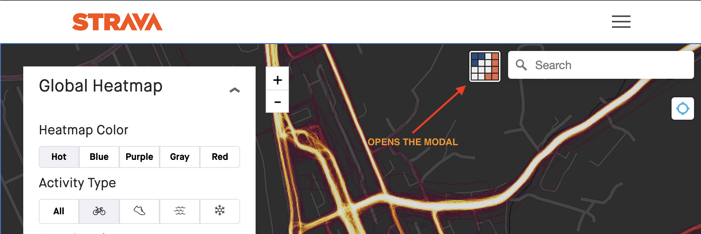
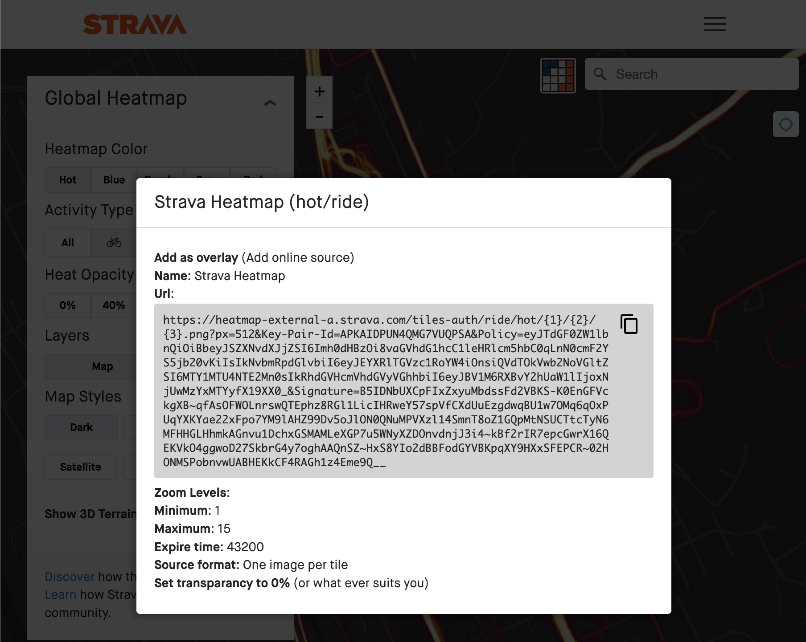

# OSMAND Strava Heatmap

This browser extension makes it easy to use the [Strava Global Heatmap][1] in OSMAND.

Accessing this imagery externally requires a set of key parameters that you obtain
by signing into the Strava website. The keys expire after a
week or so at which point you must repeat the process of getting the keys and forming the signed url.

OSM Wiki: [Using the Strava Heatmap][2]

[1]: https://www.strava.com/heatmap
[2]: https://wiki.openstreetmap.org/wiki/Strava

## Installation

Until I get to publish on the app store, you can install manually the extenssion by downloading [osmand-strava-heatmap.crx][6]

Available as a [Firefox Add-On][3] or [Chrome extension][4].
The Chrome extension should also work in Microsoft Edge and other Chromium based browsers.

## Instructions

1. Visit [strava.com/heatmap][5] and log in – sign up for a free account if you don't have one
2. _Optional_ - Select the heatmap color and activity type you want to use
3. Click the button pictured below to get the TMS imagery url prepopulated with the required
   `Key-Pair-Id`, `Policy`, and `Signature` parameters

[3]: https://addons.mozilla.org/en-US/firefox/addon/osmand-strava-heatmap/
[4]: https://chrome.google.com/webstore/detail/osmand-strava-heatmap/ID
[5]: https://www.strava.com/heatmap
[6]: https://github.com/TheMasterR/osmand-strava-heatmap/blob/main/osmand-strava-heatmap.crx
